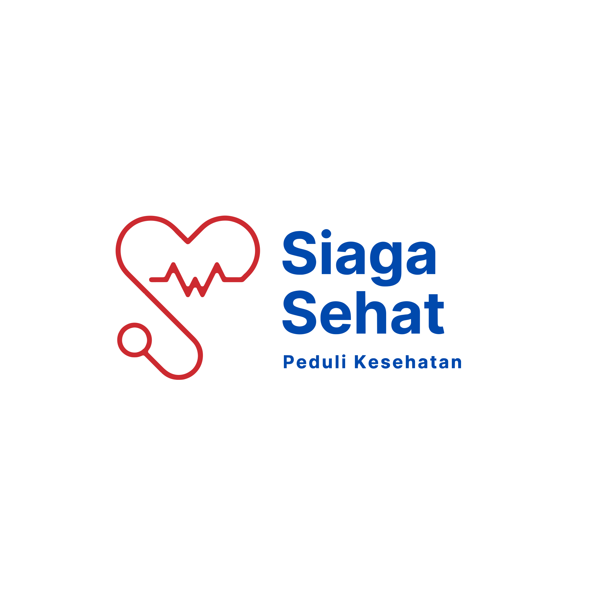

<div align="center">



### Kesehatanmu, dipantau dengan lebih siaga.

**SiagaSehat** adalah platform skrining kesehatan berbasis AI — deteksi dini kondisi kulit &
kesehatan lewat kamera, konsultasi digital interaktif, peta fasilitas kesehatan terdekat, hingga
pengingat minum obat otomatis, semua dalam satu aplikasi.

[](https://react.dev)
[](https://tanstack.com/start)
[](https://www.typescriptlang.org/)
[](https://tailwindcss.com/)
[](https://supabase.com/)
[](https://ai.google.dev/)

</div>

---

## 🩺 Tentang SiagaSehat

> **Kami tidak hanya mengobati gejala** — kami peduli dengan setiap orang, didukung skrining AI
> yang cepat dan akurat.

SiagaSehat dibangun untuk menjembatani jarak antara "merasa ada yang salah dengan tubuh" dan
"mendapat penanganan yang tepat". Lewat kombinasi computer vision, large language model, dan data
fasilitas kesehatan real-time, pengguna bisa melakukan skrining awal kapan saja, di mana saja —
lalu diarahkan ke langkah selanjutnya yang paling tepat: edukasi mandiri, konsultasi lanjutan, atau
segera ke fasilitas kesehatan terdekat.

---

## ✨ Fitur Utama

### 📷 AI Image Analysis
Analisis gambar berbasis AI dari foto yang diunggah pengguna, untuk membantu skrining awal
berbagai kondisi:

| Objek yang dianalisis | Hasil yang diberikan |
| --- | --- |
| Ruam kulit · Luka · Mata merah · Jerawat · Kuku · Lidah · Tenggorokan | Kemungkinan kondisi · Tingkat keyakinan · Penyebab · Gejala · Tingkat bahaya · Kapan harus ke dokter |

### 🤖 AI Health Consultation
Asisten kesehatan virtual yang melakukan tanya-jawab interaktif — menanyakan usia, lama gejala,
tekanan darah, hingga riwayat penyakit — lalu menyusun:

- **Preliminary Analysis** — ringkasan awal kondisi
- **Risk Assessment** — estimasi tingkat risiko
- **Health Recommendation** — langkah lanjutan yang disarankan

### 🧍 Body Pain Detector
Model tubuh manusia interaktif. Pengguna cukup memilih lokasi nyeri — kepala, dada, perut, kaki,
tangan, leher — dan AI membantu memperkirakan area yang kemungkinan menjadi sumber keluhan.

### 💊 Medicine Recommendation
Rekomendasi obat umum & herbal berdasarkan hasil skrining awal, misalnya:

- **Obat Umum** — Paracetamol, Oralit
- **Herbal** — Jahe, Madu, Kunyit

> ⚠️ Informasi ini bukan pengganti konsultasi dokter.

### 📍 Nearby Healthcare Finder
Menemukan fasilitas kesehatan terdekat lewat Google Maps — Rumah Sakit, Klinik, Puskesmas, dan
Apotek — lengkap dengan jarak, jam operasional, dan sumber data (Google / OpenStreetMap / AI
fallback).

### 📄 AI Health Report
Seluruh hasil skrining tersimpan sebagai riwayat kesehatan pribadi: tanggal pemeriksaan, hasil
analisis, dan perkembangan kondisi dari waktu ke waktu — disajikan dalam bentuk grafik pada halaman
Profil.

### ⏰ Medicine Reminder
Notifikasi & pengingat otomatis untuk minum obat, kontrol kesehatan, dan pemeriksaan rutin —
lengkap dengan pelacakan stok tablet dan riwayat kepatuhan minum obat.

### 🗺️ Anatomy Explorer
Peta tubuh 3D interaktif untuk menelusuri sistem tubuh, memilih gejala berdasarkan bagian tubuh,
dan mendapat penilaian AI awal atas kombinasi gejala yang dipilih.

### 🔐 Akun & Riwayat Kesehatan
Profil pengguna dengan data kesehatan dasar (tinggi, berat, umur, estimasi BMI), riwayat scan AI,
serta autentikasi aman berbasis Supabase.

<details>
<summary><strong>🚧 Roadmap — fitur yang sedang direncanakan</strong></summary>

<br/>

Fitur berikut ada dalam visi produk SiagaSehat dan sedang/berpotensi dikembangkan lebih lanjut:

- **🎤 Speech to Text** — pengguna cukup bicara mengenai gejala yang dirasakan
  (_"Sudah dua hari tenggorokan saya sakit dan demam."_), suara diubah menjadi teks lalu dianalisis
  AI.
- **📄 OCR Prescription Reader** — membaca resep dokter lewat OCR dan menampilkan nama obat, fungsi,
  serta aturan pakainya.
- **📚 Health Education** — edukasi kesehatan yang dipersonalisasi dari hasil skrining: cara
  pencegahan, makanan yang dianjurkan/dihindari, dan kebiasaan sehat.

</details>

---

## 🛠️ Tumpukan Teknologi

| Layer | Teknologi |
| --- | --- |
| **Frontend** | React 19, TanStack Start & Router, TypeScript, Tailwind CSS v4 |
| **UI Components** | Radix UI, shadcn-style primitives, Lucide Icons, Framer Motion |
| **AI Engine** | Google Gemini (`gemini-2.5-flash` / `gemini-2.5-pro`) dengan fallback OpenAI |
| **Backend / Auth** | Supabase (Postgres + Row Level Security + Auth) |
| **Peta & Lokasi** | Google Maps Platform, OpenStreetMap (fallback), Leaflet |
| **Data & Grafik** | Recharts, TanStack Query |
| **Tooling** | Vite, ESLint, Prettier, tsx |

---

## 📁 Struktur Proyek

```
src/
├── routes/              # Halaman: beranda, scanner, consultation, anatomy, maps, profile, reminders
├── components/
│   ├── clinic/          # Landing page (Hero, Focus, Services, Footer, dst.)
│   ├── scanner/         # AI Image Analysis, Body Pain Selector, hasil scan
│   ├── anatomy/         # Anatomy Explorer 3D & assessment AI
│   ├── maps/            # Nearby Healthcare Finder
│   ├── reminder/        # Medicine Reminder & notifikasi
│   └── layout/          # Navbar (SiteHeader) & elemen layout bersama
├── lib/
│   ├── ai/               # Integrasi Gemini / OpenAI
│   ├── scanner/          # Server function analisis gambar
│   ├── anatomy/          # Server function assessment gejala
│   ├── reminders/        # Logika penjadwalan pengingat obat
│   └── supabase/         # Client, types, auth context
└── assets/               # Logo, ilustrasi, foto
```

---

## 🚀 Menjalankan Secara Lokal

### Prasyarat
- Node.js 20+
- Akun [Supabase](https://supabase.com/) (untuk Auth & database)
- API key [Google Gemini](https://ai.google.dev/) dan/atau [OpenAI](https://platform.openai.com/)
- API key [Google Maps Platform](https://developers.google.com/maps) (opsional, untuk Nearby
  Healthcare Finder)

### 1. Clone & install dependencies
```bash
git clone <repo-url>
cd Siaga-Sehat-BALITECH
npm install
```

### 2. Konfigurasi environment variables
Buat file `.env` di root proyek:
```bash
# Supabase
VITE_SUPABASE_URL=https://xxxxx.supabase.co
VITE_SUPABASE_ANON_KEY=your-anon-key

# AI Provider (pilih salah satu / keduanya sebagai fallback)
AI_PROVIDER=gemini            # "gemini" atau "openai"
GEMINI_API_KEY=your-gemini-key
OPENAI_API_KEY=your-openai-key

# Google Maps (opsional)
VITE_GOOGLE_MAPS_API_KEY=your-maps-key
```

### 3. Jalankan development server
```bash
npm run dev
```

### Perintah lain
```bash
npm run build        # Build untuk production
npm run preview      # Preview hasil build
npm run lint          # Jalankan ESLint
npm run format         # Format kode dengan Prettier
```

---

## 🤝 Kontribusi

Pull request dan masukan sangat terbuka! Untuk perubahan besar, silakan buka issue terlebih dahulu
agar kita bisa diskusikan arah pengembangannya.

---

<div align="center">

Dibuat dengan 🩵 untuk kesehatan yang lebih siaga — **SiagaSehat, Peduli Kesehatan.**

</div>
